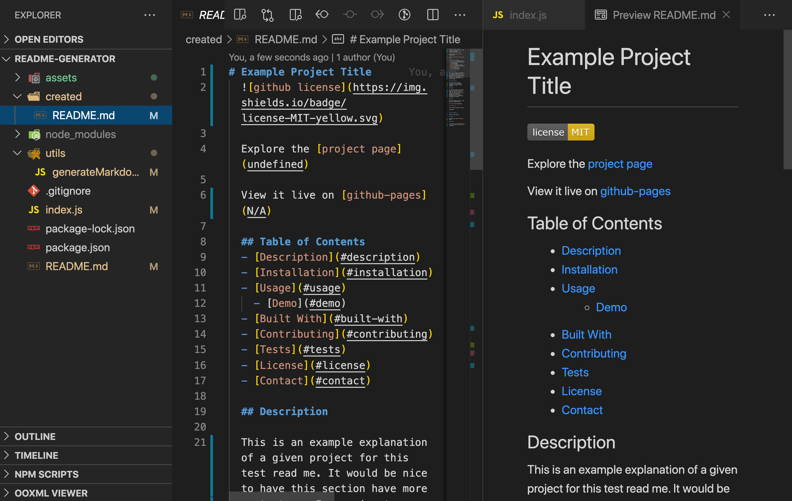

# README Generator

Explore the [project page](https://github.com/cynthiwu/readme-generator)

## Table of Contents
- [About The Project](#about-the-project)
    - [Built With](#built-with)
- [Installation](#installation)
- [Usage](#usage)
  - [Demo](#demo)
- [Roadmap](#roadmap)
- [Contributing](#contributing)
- [License](#license)
- [Contact](#contact)


## About The Project

The goal of this project was to create a command-line application that dynamically generates a README file pased on user input. Once initiated, the user is prompted to provide the followimg content:

* Project Title
* Project Description
* Installation Instructions
* Usage
* Build Tools & Technologies
* Contribution Instructions
* Tests
* License
* GitHub Username and URLs

<hr>


<hr>



<hr>

### Built With

This project was built using:

* JavaScript
* [Inquirer.JS](https://www.npmjs.com/package/inquirer)

## Installation

To get a local copy up and running, follow these simple steps:

1. Clone the repo
```sh
git clone git@github.com:cynthiwu/readme-generator.git 
```

2. Install NPM packages (i.e., Inquirer.js)
```sh
npm install
```

## Usage

It is with this application I hope engineers can spend more time creating something AWESOME, rather than writing a README file. It can be used by anyone who wants to quickly generate a basic README file. The generated file will be created and located in the "created" directory off the root. This file, or just the file content, can be copied over to any given project directory. 

### Demo

Watch the video below to see how the quiz works. 


[Demo Video](./assets/readme.mp4)

## Roadmap

I will be continuing to build out this project to provide a README template that is usable for all types of projects.

See the [open issues](https://github.com/cynthiwu/readme-generator/issues) for any proposed features (and known issues).

## Contributing

Contributions are what make the open source community such an amazing place to  learn, inspire, and create. Any contributions you make are **greatly appreciated**.

1. Fork the Project
2. Create your Feature Branch (`git checkout -b feature/AmazingFeature`)
3. Commit your Changes (`git commit -m 'Add some AmazingFeature'`)
4. Push to the Branch (`git push origin feature/AmazingFeature`)
5. Open a Pull Request

## License

None

## Contact

Cynthia Wu - [@cynthia21wu](https://twitter.com/cynthia21wu) - cynthia21wu@gmail.com

Project Link: [https://github.com/cynthiwu/readme-generator](https://github.com/cynthiwu/readme-generator)
